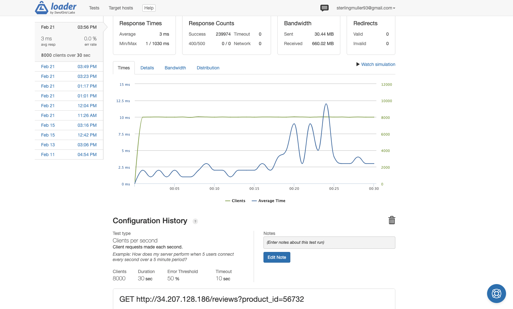

# Sterling-SDC
## Overview
***Atelier System Design*** is a backend system designed to increase performance of the Ratings and Reviews section of a mock e-commerce website. The goal was to replace the existing API with a backend system that can support a data set with over 10 million entries and can scale to meet the demands of production traffic. The databse was created with PostgreSQL and the server and API enpoints were developed using ExpressJS. The system was deployed on AWS and horizontally scaled by using an NGINX load balancer, three EC2 micro servers, and a database server. Testing was performed locally using k6 and remotely using loader.io and AWS: CloudWatch.

---
## Performance
- GET request for Reviews:
    - The max performance of the system was able to handle about **8000 RPS** with average response time of **3 ms** and **0% error rate** when tested with [loader.io](https://loader.io/).

